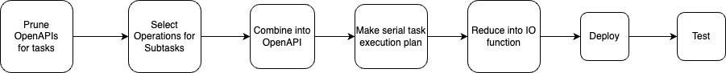

[**OpenAPI Explorer**](https://github.com/CodeFromAnywhere/openapi-explorer) combines multiple OpenAPIs in a fast, organized, and searchable interface.

## Goals

Ultimate goal: The UPI (Universal Programming Interface) ([more info](upi.md))



Requirements:

- Make URL contain state and support navigating through multiple statically generated OpenAPIs as well as custom ones.
- A friendly UI to use multiple products defined by OpenAPIs without looking to technical.
- Ability to leverage LLMs that can build action-paths based on the openapis and a query.
- Ability to use this repo as a template so people can deploy a frontend for their own openapi with customised settings, and easily extend it in any way.
- Full support of JSON-based OpenAPI convention (as much as possible)

## Non-goals

- Automatically customise theming. A little is ok, but don't go to far as there may be
- Create a documatation reference website like [readme.com](https://readme.com) (there are many)
- Add weird custom logic that is non-standard to the OpenAPI. Instead, I aim to create a layer on top of openapis to improve the implementation of the standard. I'll use [actionschema](https://actionschema.com) for this.

## Run locally

This is a [Next.js](https://nextjs.org/) project bootstrapped with [`create-next-app`](https://github.com/vercel/next.js/tree/canary/packages/create-next-app).

To run it, first run the development server:

```bash
npm run dev
# or
yarn dev
# or
pnpm dev
# or
bun dev
```

Open [http://localhost:3000](http://localhost:3000) with your browser to see the result. We deployed this using [Vercel Platform](https://vercel.com) and so can you.

This is a next project showcasing the [openapi-for-humans OpenAPI Explorer](https://github.com/CodeFromAnywhere/openapi-for-humans-react).
